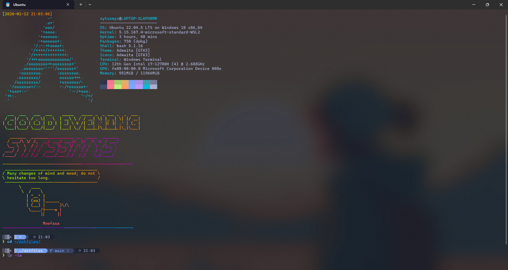

# 🌌 Tokyo-Night-WSL


> **A modern Bash environment powered by Starship & ble.sh.**
>
> *“Arch 灵魂，Tokyo 美学，WSL 核心。”*




## ✨ Features

* **🌈 Stunning Welcome Interface**: 每次启动时自动显示彩虹色的系统信息与随机极客语录。
* **🎨 Tokyo Night Theme**: 深度集成的东京夜色主题，从终端背景到补全提示。
* **🚀 Starship Prompt**: 定制化的 "Arch Linux" 胶囊风格提示符。
* **⚡ ble.sh Integration**: 为 Bash 带来类似 Zsh 的语法高亮和自动补全（紫色霓虹风）。
* **📂 Dotfiles Management**: 模块化的配置结构。

## 🛠️ Prerequisites (前置准备)

在开始之前，请确保你已经安装了以下基础环境：

1.  Windows Subsystem for Linux (WSL2): 推荐 Ubuntu 20.04/22.04。
2.  Windows Terminal: [点击安装](https://apps.microsoft.com/store/detail/windows-terminal/9N0DX20HK701)。
3.  **Nerd Fonts**: 必须安装 **[Cascadia Code NF](https://github.com/ryanoasis/nerd-fonts/releases)**。
    * *⚠️ 警告：这是显示图标的关键。如果不安装此字体，终端会出现乱码方块。*
    * 下载并安装 `CascadiaCodeNF-Regular.ttf` 即可。

---

## 🎨 Part 1: Windows Terminal 配置 

我们需要先配置 Windows Terminal 的配色与字体。

1.  打开 Windows Terminal，点击下拉箭头 `⌄` -> 设置 (Settings)。
2.  点击左下角的打开 JSON 文件 (Open JSON file)。
3.  在 `"schemes": []` 数组中粘贴以下内容（Tokyo Night 配色方案）：

```json
{
  "name": "Tokyo Night",
  "background": "#1a1b26",
  "foreground": "#a9b1d6",
  "black": "#32344a",
  "red": "#f7768e",
  "green": "#9ece6a",
  "yellow": "#e0af68",
  "blue": "#7aa2f7",
  "purple": "#ad8ee6",
  "cyan": "#449dab",
  "white": "#787c99",
  "brightBlack": "#444b6a",
  "brightRed": "#ff7a93",
  "brightGreen": "#b9f27c",
  "brightYellow": "#ff9e64",
  "brightBlue": "#7da6ff",
  "brightPurple": "#bb9af7",
  "brightCyan": "#0db9d7",
  "brightWhite": "#acb0d0",
  "selectionBackground": "#515c7e",
  "cursorColor": "#c0caf5"
}

```

4. **应用设置**：
回到设置界面，找到你的 Ubuntu 配置文件 -> 外观 (Appearance)：
* 配色方案 (Color scheme): 选择刚刚添加的 `Tokyo Night`。
* 字体 (Font face): 选择 `Cascadia Code NF`。
* 透明度 (Background opacity): 建议设为 `80%` 并开启亚克力效果。


---

## 📦 Part 2: WSL 环境配置 

外壳准备好后，我们进入 WSL 安装核心工具。

### 1. 安装依赖

```bash

# 更新源并安装欢迎界面所需的工具
sudo apt update
sudo apt install -y neofetch fortune-mod lolcat

# 安装 Starship
curl -sS [https://starship.rs/install.sh](https://starship.rs/install.sh) | sh

# 安装 ble.sh (Bash Line Editor)
git clone --recursive --depth 1 [https://github.com/akinomyoga/ble.sh.git](https://github.com/akinomyoga/ble.sh.git)
make -C ble.sh install PREFIX=~/.local

```

### 2. 克隆本仓库

```bash
git clone git@github.com:你的用户名/Tokyo-Night-WSL.git ~/dotfiles

```

### 3. 部署配置文件 (Symlink)

使用软链接覆盖系统默认配置（建议先备份你原本的 .bashrc）：

```bash
# 备份原配置 (可选)
mv ~/.bashrc ~/.bashrc.bak

# 创建目录结构
mkdir -p ~/.config/blesh

# 建立软链接
ln -s ~/dotfiles/bashrc ~/.bashrc
ln -s ~/dotfiles/config/starship.toml ~/.config/starship.toml
ln -s ~/dotfiles/config/blesh/init.sh ~/.config/blesh/init.sh

```

---

## 🚀 Part 3: 启动 (Launch)

一切就绪！现在执行以下命令，或重启终端以获得最佳渲染效果：

```bash
source ~/.bashrc

```

🎉 **Enjoy your new modern terminal!**

---

## 🤝 Credits

* [Starship](https://starship.rs/)
* [ble.sh](https://github.com/akinomyoga/ble.sh)
* [Tokyo Night Theme](https://github.com/folke/tokyo-night.nvim)


